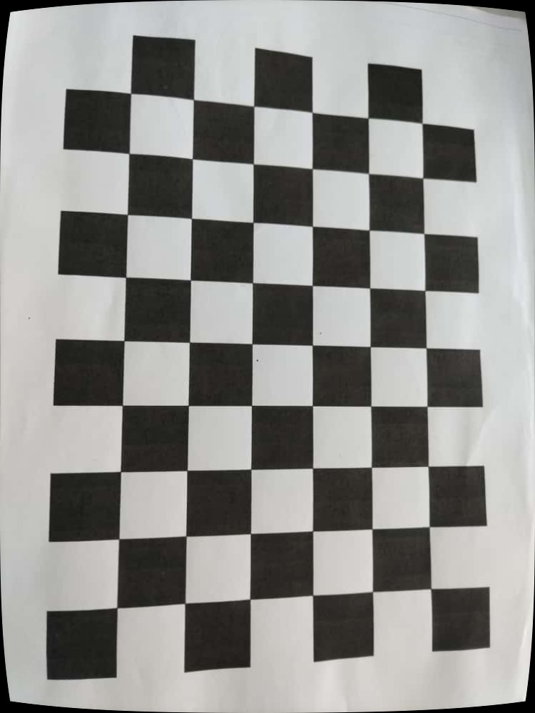
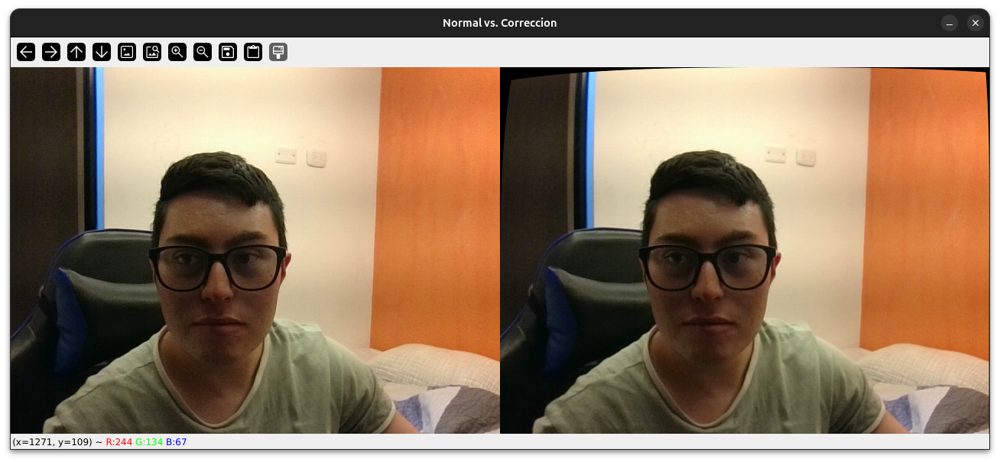

# Práctica 1: Calibración de Cámaras con Tablero de Ajedrez

**Estudiante:** 
- Luis Alfonso Pedraos Suarez
- Anderson David Morales Chila
- Sergio Alejandro Nova Perez
- Fredy Andres Rosero Cristancho

**Correo:** 
- lpedraos@unal.edu.co
- amoralesch@unal.edu.co
- snovap@unal.edu.co
- faroseroc@unal.edu.co

**Fecha:** 20 de Septiembre de 2025

## Resumen de la Implementación

Esta práctica implementa un sistema completo de calibración de cámaras utilizando un patrón de tablero de ajedrez, siguiendo los objetivos establecidos en la guía del taller.

### Desarrollo Realizado

#### 1. **Calibración Básica**
- **Dataset:** 18 imágenes de tablero de ajedrez (9x6 esquinas internas)
- **Algoritmo:** OpenCV `cv2.calibrateCamera()`
- **Resultado:** Obtención exitosa de parámetros intrínsecos y coeficientes de distorsión

**Imagen original del dataset:**


#### 2. **Parámetros Obtenidos**
```
Matriz de la cámara:
[[769.71   0.00  378.45]
 [  0.00 765.11  500.59]
 [  0.00   0.00    1.00]]

Coeficientes de distorsión:
[ 5.75e-02 -3.77e-01 -1.86e-04  1.60e-03  6.28e-01]
```

#### 3. **Validación de Calidad**
- **Error medio de reproyección:** 0.050 píxeles
- **Interpretación:** Calibración de excelente calidad (error < 0.1 píxeles)

#### 4. **Corrección de Distorsión**
- Implementación de `cv2.undistort()` para corrección de imágenes estáticas
- Generación de imagen corregida: `calibrated_result.jpg`

**Resultado de la corrección:**


#### 5. **Video en Tiempo Real**
- Sistema de comparación en vivo: original vs corregida
- Interfaz interactiva con opciones de guardado
- Visualización lado a lado para análisis de diferencias



### Cumplimiento de Objetivos

✅ **Calibrar cámara con imágenes capturadas**  
✅ **Calcular error medio de reproyección**  
✅ **Aplicar corrección a video en tiempo real**  
✅ **Preparar material para discusión de diferencias**

### Archivos Generados

- `practice.ipynb` - Código principal de la práctica
- `calibrated_result.jpg` - Imagen estática corregida
- `frame_comparison.jpg` - Comparación de frames de video (cuando se ejecute)

### Análisis Visual

La comparación entre la imagen original y la corregida permite observar:
- **Corrección de distorsión radial**: Las líneas rectas del tablero se mantienen rectas
- **Mejora en la geometría**: Los cuadrados del tablero recuperan su forma cuadrada ideal
- **Calidad de la calibración**: La corrección es sutil pero efectiva, indicando una distorsión moderada de la cámara

### Conclusión

La práctica se completó exitosamente con una calibración de alta precisión, demostrada por el bajo error de reproyección obtenido. El sistema permite tanto corrección de imágenes estáticas como procesamiento en tiempo real.

Además, dado que las webcams y cámaras de celular modernas suelen venir con lentes ya bien corregidos de fábrica, la distorsión readial/tangencial es muy baja, entonces, al corregir, no se nota casi la distorsión.
